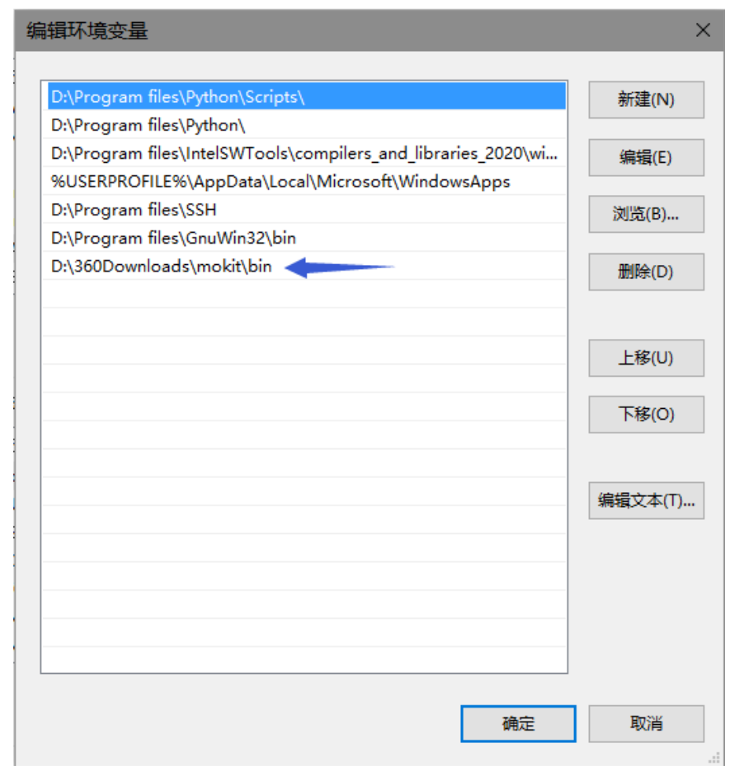

# Windows

If you only want to use some utilities of MOKIT (e.g. transfer MOs among various programs,
generate input files of various programs), the most convenient way is probably to use the pre-built
(or pre-compiled) Windows executables. 
Note that the version of pre-built Windows executables is
often older than that of MOKIT source code, so you are recommended to download source code and
compile them under Linux.

Only 20+ out of all utilities in MOKIT are provided. 
These executables are compressed into .7z
file and can be downloaded at [Releases](https://gitlab.com/jxzou/mokit/-/releases). 
Download, uncompress it, and set the environment variables,
then these utilities can used in any directory.

To set the environment variables, search ‘environment’ (“环境变量” in Chinese) in the
Windows search bar, then press `Enter` and click `Edit` to edit the `PATH` variables. 
Create a new path and type the path of MOKIT binary directory. 
For example, on my computer the path is
`D:\360Downloads\mokit\bin`.

Press the combination keys `Win+R` on the keyboard, type ‘cmd’ to prompt CMD, and **change
into the directory where your .fch(k) file holds**, simply run like
