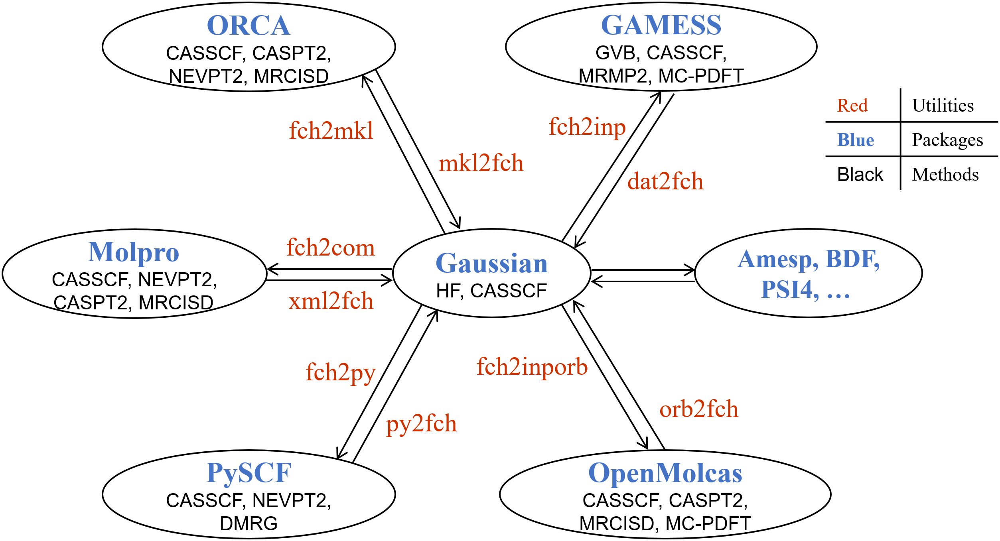

# 4.5 List of Utilities in MOKIT
The utilities of transferring MOs are summarized in the following figure:



For detailed explanations of all utilities, please read the following subsections.

## 4.5.1 add_bgcharge_to_inp
This utility is designed to add background charges to the input file of various software packages. If you do not use background charges in your computation, you can skip this section. But if you do use them (e.g. in subsystems of fragmentation-based or embedding methods), they are not recorded in any .fch(k) file. This can be viewed as a defect of the .fch(k) file. Therefore, the generated input file by utilities fch2com, fch2inp, fch2iporb, fch2psi or bas_fch2py will contain no background charges either.

To add background charges into the input file, you have to provide a .chg file which contains information of those charges. An example of such file is shown below
```
2
 4.0   0.0   0.0    0.1
-4.0   0.0   0.0    0.1
```
The first line holds the number of point charges. While the charges are written starting from the second line, with format x, y, z, charge.

Note that in all computations of the `automr` program, this situation is explicitly considered. This utility will be automatically called if needed. The only situation when you need this utility is merely using utilities fch2com, fch2inp, fch2iporb, fch2psi or bas_fch2py (and of course, with background charges).

## 4.5.2 bas_fch2py
Generate a PySCF .py file from a Gaussian .fch file. The Cartesian coordinates and basis set data are written in the .py file. Note: `automr` does not use any built-in basis sets of PySCF, but always generates the basis set data from .fch file. This procedure ensures an (almost) exactly identical setting of basis set in Gaussian and PySCF.

This utility is in fact a wrapper of two utilities `fch2inp` and `bas_gms2py`. So
if you only want to compile this utility, you have to compile `fch2inp` and `bas_gms2py`
additionally.

Note that if you use background charges in your studied system, the background charges are not recorded in the .fch(k) file. So there are no background charges in the generated .py file, either. To add background charges, you need to use the utility `add_bgcharge_to_inp` (see [4.5.1](#451-add_bgcharge_to_inp)).

## 4.5.3 bas_gau2molcas
Transform a basis set file in Gaussian format to another in (Open)Molcas format.
If you turn on RI (see [4.4.28 RI](#4428-ri)) and use OpenMolcas as the `CASSCF_prog`,
there is no RI-JI auxiliary basis set file in current version of OpenMolcas package.
Therefore, this utility will be called automatically to transform the auxiliary
basis set file in `$MOKIT_ROOT/basis/` directory to the (Open)Molcas syntax. And
the transformed file will normally be in `$MOLCAS/basis_library/jk_Basis/`.

You can, of course, use this utility by yourself. An example is shown below
```
bas_gau2molcas def2-universal-jkfit
```
Assuming the basis set file def2-universal-jkfit (in Gaussian format) has been put in the current directory, this command will generate a basis set file named DEF2-UNIVERSAL-JKFIT (in (Open)Molcas format).

## 4.5.4 bas_gms2bdf
Generate two BDF files (`_bdf.inp` and .BAS) from a GAMESS .inp/.dat file. Cartesian coordinates are written in the `_bdf.inp` file, while the basis set data is held in .BAS file. Note that BDF does not support Cartesian-type basis functions, so only spherical harmonic functions will be used. The 'ISPHER' keyword in .inp/.dat file (if any) will be ignored. One example is shown below
```
bas_gms2bdf a.inp
```
Generate a_bdf.inp and A.BAS files, for R(O)HF or UHF type wave function.

## 4.5.5 bas_gms2dal
Generate Dalton .dal and .mol files from a GAMESS .inp/.dat file. The Cartesian coordinates and basis set data are written in the .mol file.
Two examples are shown and explained below

(1) `bas_gms2dal a.inp`  
Generate .mol and .dal file, in which the keywords 'Cartesian' for all atom are written (in order to use pure Cartesian type of basis functions)

(2) `bas_gms2dal a.inp -sph`  
Generate .,mol and .dal file, in which the keywords 'Cartesian' of each atom are not written (in order to use pure spherical harmonic type of basis functions).

## 4.5.6 bas_gms2molcas
Generate an (Open)Molcas .input file from a GAMESS .inp/.dat file. The Cartesian coordinates and basis set data are written in the .input file.
Two examples are shown and explained below

(1) `bas_gms2molcas a.inp`  
Generate .inp file, in which the keywords 'Cartesian' of each atom are written (in order to use pure Cartesian type of basis functions)

(2) `bas_gms2molcas a.inp -sph`  
Generate .inp file, in which the keywords 'Cartesian' of each atom are not written (in order to use pure spherical harmonic type of basis functions).

## 4.5.7 bas_gms2molpro
Generate a Molpro .com file from a GAMESS .inp or .dat file. The Cartesian coordinates and basis set data are written in the .com file. 
Two examples are shown and explained below

(1) `bas_gms2molpro a.inp`  
Generate .inp file, in which the keyword 'Cartesian' is written (in order to use pure Cartesian type of basis functions)

(2) `bas_gms2molpro a.inp -sph`  
Generate .inp file, in which the keyword 'Cartesian' is not written (in order to use pure spherical harmonic type of basis functions).

## 4.5.8 bas_gms2psi
Generate a PSI4 `_psi.inp` file from a GAMESS .inp/.dat file. The Cartesian coordinates and basis set data are written in the `_psi.inp` file.
Two examples are shown and explained below

(1) `bas_gms2psi a.inp`  
Generate a_psi.inp file, in which the keyword 'cartesian' is written (in order to use pure Cartesian type of basis functions)

(2) `bas_gms2psi a.inp -sph`  
Generate a_psi.inp file, in which the keyword 'spherical' is written (in order to use pure spherical harmonic type of basis functions).

## 4.5.9 bas_gms2py
Generate a PySCF .py file from a GAMESS .inp/.dat file. The Cartesian coordinates and basis set data are written in the .py file.
Two examples are shown and explained below

(1) `bas_gms2py a.inp`  
Generate .inp file, in which the keyword 'mol.cart = True' is written (in order to use pure Cartesian type of basis functions)

(2) `bas_gms2py a.inp -sph`  
Generate .inp file, in which the keyword 'mol.cart = True' is not activated (in order to use pure spherical harmonic type of basis functions).

## 4.5.10 bdf2fch
Transfer MOs from BDF (.scforb/.inporb/.casorb, etc) to Gaussian .fch file. Note that bdf2fch can not generate a .fch file from scratch. The user must provide a .fch(k) file, and MOs in that file will be replaced. Two examples are shown and explained below

(1) `bdf2fch a.scforb a.fch`  
This is used for transferring R(O)HF, UHF or CASSCF orbitals.

(2) `bdf2fch a.casorb a.fch -no`  
This is used for transferring CASCI or CASSCF NOs and NOONs.

NOTE: the recommended way is to firstly use Gaussian to generate a .fch file (with keywords 'nosymm int=nobasistransform'), then generate the `*_bdf.inp` file from .fch file. After BDF computations finished, you can transfer MOs from .scforb/.casorb back to .fch file. This procedure seems a little bit tedious, but it ensures an exact reproduce of energy in BDF.

This utility supports only spherical harmonic functions. To transfer MOs from Gaussian
to BDF, see [4.5.16 fch2bdf](#4516-fch2bdf).

## 4.5.11 bdf2mkl
Transfer MOs from BDF (.scforb/.inporb/.casorb, etc) to ORCA. The ORCA .inp and .mkl file will be generated. This utility is actually a wrapper of two utilities bdf2fch and fch2mkl. Thus bdf2mkl can not generate a .fch file from scratch, either. The user must provide a .fch(k) file, and MOs in that file will be replaced. Two examples are shown and explained below

(1) `bdf2mkl a.scforb a.fch`  
This is used for transferring RHF, ROHF, UHF or CASSCF orbitals.

(2) `bdf2mkl a.casorb a.fch -no`  
This is used for transferring CASCI or CASSCF NOs and NOONs.

NOTE: the recommended way is to firstly use Gaussian to generate a .fch file (with keywords 'nosymm int=nobasistransform'), then generate the `_bdf.inp` file from .fch file. After BDF computations finished, you can transfer MOs from .scforb/.casorb back to .fch file. This procedure seems a little bit tedious, but it ensures an exact reproduce of energy in BDF.

## 4.5.12 chk2gbw
Convert one (or more) .chk file into .gbw file. The Gaussian utility formchk and ORCA utility orca_2mkl will be called automatically. Multiple chk files are supported. For example,

(1) `chk2gbw a.chk`  
Convert a.chk to a.gbw.

(2) `chk2gbw *.chk`  
Convert all chk files in the current directory into corresponding gbw files.

## 4.5.13 dal2fch
Transfer MOs from Dalton (i.e. DALTON.MOPUN file) to Gaussian .fch(k) file. Note that dal2fch can not generate a .fch file from scratch. The user must provide a .fch(k) file, and MOs in that file will be replaced. Two examples are shown and explained below

(1) `dal2fch a.dat a.fch`  
This is used for transferring R(O)HF or CASSCF orbitals.

(2) `dal2fch a.dat a.fch -no`  
This is used for transferring CASCI/CASSCF natural orbitals and corresponding natural orbital occupation numbers. To transfer MOs from Gaussian to Dalton, see [4.5.18 fch2dal](#4518-fch2dal).

## 4.5.14 dat2fch
Transfer MOs from GAMESS (.inp/.dat file) to Gaussian .fch file. Note that dat2fch can not generate a .fch file from scratch. The user must provide a .fch(k) file, and MOs in that file will be replaced. Four examples are shown and explained below

(1) `dat2fch a.dat a.fch`  
This is used for transferring R(O)HF, UHF or CASSCF orbitals.

(2) `dat2fch a.dat a.fch -gvb 5`  
This is used for transferring GVB orbitals for spin singlet molecule. The order of GVB orbitals is different between Gaussian and GAMESS. Thus you must specify `-gvb [npair]` to tell the utility the number of GVB pairs, so that dat2fch can adjust the order of MOs.

(3) `dat2fch a.dat a.fch -gvb 5 -open 1`  
This is used for transferring GVB orbitals for non-singlet molecule. In this way, you tell the utility the number of GVB pairs and singly-occupied orbitals, so that dat2fch can adjust the order of MOs.

(4) `dat2fch a.dat a.fch -no 5 10`  
This is used for transferring natural orbitals (NOs) of CASCI/CASSCF. In this way, you tell the utility the beginning index and final index of NOs in .fch file, so that dat2fch can work correctly.

NOTE: the recommended way is to firstly use Gaussian to generate a .fch file (with keywords 'nosymm int=nobasistransform'), then generate the .inp file from .fch file. After GAMESS computations finished, you can transfer MOs from .dat back to .fch file. This procedure seems a little bit tedious, but it ensures an exact reproduce of energy in GAMESS.

This utility supports two types of basis functions: (1) pure spherical harmonic functions; (2) pure Cartesian functions. To transfer MOs from Gaussian to GAMESS, see [4.5.19 fch2inp](#4519-fch2inp).

## 4.5.15 extract_noon2fch
Extract natural orbital occupation numbers (NOONs) from the following types of files  
(1) .out file of PySCF  
(2) .dat file of GAMESS  
(3) .gms file of GAMESS  
(4) .out file of ORCA  
(5) .out file of PSI4  
and write NOONs (as the 'Alpha Orbital Energies' section) into a given .fch file. This is for the convenience of visualizing orbitals using GaussView or Multiwfn+VMD.

## 4.5.16 fch2bdf
Generate three BDF files (`_bdf.inp`, .BAS, .scforb/.inporb) from a Gaussian .fch(k) file. Cartesian coordinates are written in the `_bdf.inp` file, while the basis set data is held in .BAS file. The molecular orbitals are written in the .scforb/.inporb file. Note that BDF does not support Cartesian-type basis functions, so only spherical harmonic functions will be used. If there exists any Cartesian-type basis function in .fch(k) file, this utility will signal errors. Two examples are shown and explained below

(1) `fch2bdf a.fch`  
This is used for transferring RHF/ROHF/UHF orbitals. Three files will be generated: a_bdf.inp, A.BAS and a.scforb. The data in 'Alpha Orbital Energies' and 'Beta Orbital Energies' sections in .fch file will be read and printed into the a.scforb file.

(2) `fch2bdf a.fch -no`  
This is used for transferring NOs. Three files will be generated: a_bdf.inp, A.BAS and a.inporb. Note the data of 'Alpha Orbital Energies' section in .fch file (assumed occupation numbers) will be read and printed into the a.inporb file, but the occupation numbers do not affect subsequent computations.

This utility will call another two utilities `fch2inp` and `bas_gms2bdf`. So if you want to compile fch2bdf, you have to compile `fch2inp` and `bas_gms2bdf` additionally.

Note that to transfer HF orbitals, the data in 'Alpha Orbital Energies' and 'Beta Orbital Energies' section should be genuine orbital energies, since BDF program will use these values. Random values (like zero) will affect SCF computations and thus it cannot converge in 1 cycle (or even fails to converge). This is totally different with other quantum chemistry software packages where only orbitals are useful and orbital energies are useless. When transferring NOs, the occupation numbers in 'Alpha Orbital Energies' section do not affect subsequent computations.

To transfer MOs from BDF back to Gaussian, see [4.5.10 bdf2fch](#4510-bdf2fch).

## 4.5.17 fch2com
Generate a Molpro .com file from a Gaussian .fch(k) file, with alpha MOs written in a .a file. One example is shown below
```
fch2com a.fch
```
This is used for transferring R(O)HF, UHF or CASSCF orbitals.

This utility will call another two utilities `fch2inp` and `bas_gms2molpro`. So
if you want to compile fch2com, you have to compile `fch2inp` and `bas_gms2molpro`
additionally.

Note that in Windows* OS, any file with .com suffix/extension may be automatically associated with system, in which case double click of the mouse to open this file does not work. You have to right click on the .com file and choose 'open with'. You can modify the suffix/extension to .inp if you do not like that.

Note that if you use background charges in your studied system, the background charges are not recorded in the .fch(k) file. So there are no background charges in the generated .com file, either. To add background charges, you need to use the utility `add_bgcharge_to_inp` (see [4.5.1](#451-add_bgcharge_to_inp)).
To transfer MOs from Molpro back to Gaussian, see [4.5.36 xml2fch](#4536-xml2fch).

## 4.5.18 fch2dal
Generate Dalton .dal and .mol files from a Gaussian .fch(k) file, where MOs are written in .dal file, and the Cartesian coordinates as well as basis set data are written in .mol file. One example is shown below
```
fch2dal a.fch
```
This is used for transferring R(O)HF or CASSCF orbitals. Note that there is no UHF method (or any methods based on UHF), thus you cannot use a .fch file containing UHF orbitals to transfer orbitals. To transfer MOs from Dalton back to Gaussian, see [4.5.13 dal2fch](#4513-dal2fch).

## 4.5.19 fch2inp
Generate a GAMESS .inp file from a Gaussian .fch(k) file, with MOs written in the .inp file. The keywords in .inp file is already suitable for common simple calculations, but do check or modify it if you have additional requirements.

Note that due to the different types of MOs (R(O)HF, UHF, GVB, and CASSCF orbitals), the fch2inp offers different options. Three examples are shown and explained below

(1) `fch2inp a.fch`  
This is used for transferring R(O)HF, UHF or CASSCF orbitals.

(2) `fch2inp a.fch -gvb 5`  
This is used for transferring GVB orbitals for spin singlet molecule. The order of GVB orbitals is different between Gaussian and GAMESS. Thus you must specify `-gvb [npair]` to tell the utility fch2inp the number of GVB pairs, so that fch2inp can adjust the order of MOs.

(3) `fch2inp a.fch -gvb 5 -open 1`  
This is used for transferring GVB orbitals for non-singlet molecule. In this way, you tell the utility fch2inp the number of GVB pairs and singly-occupied orbitals, so that fch2inp can adjust the order of MOs.

This utility supports two types of basis functions: (1) pure spherical harmonic functions; (2) pure Cartesian functions. To transfer MOs from GAMESS back to Gaussian, see [4.5.14 dat2fch](#4514-dat2fch).

Note that if you use background charges in your studied system, the background charges are not recorded in the .fch(k) file. So there are no background charges in the generated .inp file, either. To add background charges, you need to use the utility `add_bgcharge_to_inp` (see [4.5.1](#451-add_bgcharge_to_inp)).

## 4.5.20 fch2inporb
Transfer MOs from Gaussian to (Open)Molcas. A .input file and a .INPORB file will be generated. The .input file is the input file of (Open)Molcas, and it contains the geometry, basis set data and keywords. The .INPORB file contains the MOs. Two examples are shown and explained below

(1) `fch2inporb a.fch`  
This is used for transferring R(O)HF, UHF or CASSCF orbitals.

(2) `fch2inporb a.fch -no`  
This is used for transferring NOs.

The option '-no' means reading NOONs and NOs from .fch(k) file and printing them into the .INPORB file. The NOONs written in the .INPORB file does not affect the calculations in OpenMolcas at all. It just make the file appear more readable.

This utility will call another two utilities `fch2inp` and `bas_gms2molcas`. So
if you want to compile `fch2inporb`, you have to compile `fch2inp` and `bas_gms2molcas`
additionally.

Note: if you use background charges in your studied system, the background charges are not recorded in the .fch(k) file. So there are no background charges in the generated .input file, either. To add background charges, you need to use the utility `add_bgcharge_to_inp` (see [4.5.1](#451-add_bgcharge_to_inp)).

Note: if you provide a .fch file generated by G09 and this .fch file is generated with DKH2 Hamiltonian in its corresponding .gjf file, the DKH2 information is not recorded in the .fch file. In such case, if you run fch2inporb xxx.fch, the generated xxx.input file will not include keyword Relativistic = R02O, you need to manually add this keyword into the .input file. This is not a problem for G16 since the Route section is recorded in .fch file for G16 so that it can be recognized/identified by fch2inporb.

To transfer MOs from (Open)Molcas back to Gaussian, see [4.5.32 orb2fch](#4532-orb2fch).

## 4.5.21 fch2mkl
Transfer MOs from Gaussian to ORCA. One .inp file and one .mkl file will be generated. The .input file of ORCA holds the geometry, basis set data and keywords. The .mkl file contains the MOs. One example is shown below
```
fch2mkl a.fch
```
This is used for transferring R(O)HF, UHF or CASSCF orbitals. Two files will be generated: a_o.inp and a_o.mkl. The `_o` characters are added to avoid file overwritten in case that there is already a xxx.inp file in the current directory (for example, generated by utility fch2inp).

To transfer MOs from ORCA back to Gaussian, see [4.5.30 mkl2fch](#4530-mkl2fch)
and [4.5.31 mkl2gjf](#4531-mkl2gjf).

Note 1: Assuming your ORCA input file is a.inp, you need to run `orca_2mkl a_o -gbw` to generate the ORCA a.gbw file since ORCA cannot read a.mkl file directly.

Note 2: The default keywords in .inp file does not contain any RI approximations, and settings of VeryTightSCF are written (the author does this to ensure an exact reproduce of energy in ORCA). You can modify keywords as you wish, but note that an exact reproduce of energy may not be assured.

Note that if you use background charges in your studied system, the background charges are not recorded in the .fch(k) file. So there are no background charges in the generated .inp or .mkl file, either. To add background charges, you need to use the utility `add_bgcharge_to_inp` (see [4.5.1](#451-add_bgcharge_to_inp)).

## 4.5.22 fch2psi
Transfer MOs from Gaussian to PSI4. Two or three files will be generated: `*_psi.inp`, `*.A`, and `*.B` (if Beta MOs exist). The `_psi.inp` file of PSI4 holds the geometry, basis set data and keywords. The .A (and .B) file contains the Alpha (Beta) MOs. One example is shown below
```
fch2psi a.fch
```
This is used for transferring R(O)HF, UHF or CASSCF orbitals.

Note that this utility will call another two utilities – fch2inp and bas_gms2psi, remember to compile them additionally.

Note that if you use background charges in your studied system, the background charges are not recorded in the .fch(k) file. So there are no background charges in the generated .com file, either. To add background charges, you need to use the utility `add_bgcharge_to_inp` (see [4.5.1](#451-add_bgcharge_to_inp)).

PSI4 can generate a .fch(k) file after calculation finished, which is equivalent to transferring MOs from PSI4 back to Gaussian.

## 4.5.23 fch2qchem
Transfer MOs from Gaussian to Q-Chem. For R(O)HF, UHF and DFT methods, two files will be generated: .in and 53.0. The molecular orbitals are stored in the file 53.0. For GVB, three files will be generated: .in, 53.0, and 169.0. The GVB orbitals are stored both in files 53.0 and 169.0 (the same content). Two examples are shown below

(1) `fch2qchem h2o.fch`  
This is used for transferring R(O)HF, UHF or CASSCF orbitals.

(2) `fch2qchem h2o.fch -gvb 2`  
This is used for transferring GVB orbitals. The orbitals in h2o.fch must be ordered in Gaussian GVB preference (bonding1, bonding2, anti-bonding2, anti-bonding1). And `-gvb 2` tells fch2qchem to write GVB-PP related keywords into the .in file.

## 4.5.24 fch2qm4d
Transfer MOs from Gaussian to QM4D. Input files for QM4D (.xyz, .inp, .xml and basis files for each element) will be generated. One example is shown below
```
fch2qm4d a.fch
```
This is used for transferring RHF or UHF orbitals.

Note 1: Currently QM4D supports only Cartesian-type basis sets. Thus this utility will signal error if you provide a .fch(k) file which has spherical harmonic functions (i.e. 5D 7F).

Note 2: QM4D supports ECP, but currently it seems to use spherical harmonic functions in ECP, so even if you specify `6D 10F` in Gaussian, the electronic energies of Gaussian v.s. QM4D will not be equal to each other. This tiny defect does not affect transferring MOs, and SCF can be converged in several cycles with almost no energy change.

Note that if you use background charges in your studied system, the background charges are not recorded in the .fch(k) file. So there are no background charges in the generated .inp file, either. To add background charges, you need to use the utility `add_bgcharge_to_inp` (see [4.5.1](#451-add_bgcharge_to_inp)).

## 4.5.25 fch2wfn
Generate .wfn file from a specified .fch(k) file. Two examples are shown below
(1) `fch2wfn a.fch`  
For a .fch file in which ground state HF/DFT orbitals are recorded, generate the corresponding a.wfn file.

(2) `fch2wfn a.fch -no`  
For a .fch file in which natural orbitals are recorded, generate the corresponding a.wfn file.

## 4.5.26 fch_mo_copy
Copy MOs from one .fch file into another .fch file. An example is shown below
```
fch_mo_copy a.fch b.fch
```
The default is to copy Alpha MOs in a.fch to Alpha MOs in b.fch. There are 4 optional parameters `-aa`, `-ab`, `-ba`, `-bb`. For example, `-ab` means copying Alpha MOs from a.fch to Beta MOs in b.fch.

## 4.5.27 fch_u2r
Transform a UHF-type .fch file into a RHF-type one. Only alpha MOs are retained.

## 4.5.28 frag_guess_wfn
This utility has two functions: (1) perform a SCF (i.e. HF or DFT) computation using initial guess constructed from molecular orbitals of fragments. (2) generate GAMESS .inp file for GKS-EDA or Morokuma-EDA calculation.

The Gaussian software package will be called to perform SCF computation for each fragment. The input file is exactly the Gaussian .gjf file, in which the atoms, charge and spin multiplicities of each fragment are properly defined. See examples in [5.3](#53-examples-of-the-utility-frag_guess_wfn).

Explanations of function (1):  
Note: implementation of this function is not yet finished.  
The SCF computations of radicals and transition-metal-containing molecules often suffers from multiple UHF/UKS solutions. Using a proper fragment guess (i.e., the 'guess(fragment=N)' keyword in Gaussian), one can then obtain a desired SCF solution or a lower energy solution after SCF converged and a check of wavefunction stability of the whole system. However, the wavefunction stability of each fragment in the initial guess cannot be assured in Gaussian, thus not efficient for complicated molecules. This utility – frag_guess_wfn – can ensure the wavefunction stability of each fragment and allow the usage of RHF/UHF (or RKS/UKS) for different fragments, which would improve the quality of initial guess and save time for subsequent SCF computation of the whole system. Examples of the fragment guess can be found at http://gaussian.com/afc. If you can read Chinese, a nice introduction to this topic from Sobereva's blog
[《谈谈片段组合波函数与自旋极化单重态》](http://sobereva.com/82) is recommended.

Explanations of function (2):  
The Morokuma-EDA calculation is supported by GAMESS-US program, while GKS-EDA calculation is supported by the XEDA program (a modified GAMESS-US program from Prof. Peifeng Su of Xiamen University, supi@xmu.edu.cn). These methods are very useful but often suffer from SCF convergence failure due to the "just so-so" SCF convergence techniques in GAMESS. Even if all SCF converge, their wave function stabilities cannot be checked in GAMESS.

Fortunately, these two methods can read wave function of each fragment (and of total system in GKS-EDA), if we can provide such wave function as initial guess. Therefore, the utility frag_guess_wfn will call Gaussian to perform SCF calculations for each fragment (and for total system in GKS-EDA), then write all MOs into the .inp file, so that all SCF steps during an EDA calculation will converge immediately.

If UHF/UDFT method is specified, wave function stability of each fragment (and of total system in GKS-EDA) will be checked. This is very important for biradical and transition-metal-containing systems. If any fragment is singlet and UHF/UDFT method is specified, broken symmetry initial guess (i.e., guess=mix) will be automatically applied.

The Windows* pre-built executable frag_guess_wfn will be provided at Releases in
the near future. Note that you should define the environment variable `%GAUSS_EXEDIR%`
(in Windows* OS) before using this utility, since Gaussian program would be called
to perform SCF computations. For example, search "environment variable" in your
Windows search bar and click **Edit** to add a new environment variable, and set
it as the correct G03W, G09W or G16W directory. A screenshot is shown below


## 4.5.29 gvb_sort_pairs
Sort (part of) MOs in descending order of the pair coefficients of the 1st natural orbital in each pair. This utility is designed only for the GAMESS .dat file. A new .dat file will be generated, in which the sorted MOs and pair coefficients are held.

## 4.5.30 mkl2fch
Transfer MOs from ORCA .mkl file into Gaussian .fch(k) file. A .fch(k) file must be provided by the user, in which the geometry and basis set data are valid (i.e. specifying 'noysmm int=nobasistransform 5D 7F' in Gaussian).

Note that the number of digits in .mkl file is only 7, and the scientific notation is not used. Therefore, the transferred MOs will not be very accurate. This should be sufficient for visualizing orbitals and common wavefunction amalysis, but may cause up to 10-5 a.u. error on electronic energy in further computations. This can be viewed as a defect of the orca_2mkl utility in ORCA program. You are recommended to bring up an issue or request in the ORCA forum (https://orcaforum.kofo.mpg.de), to suggest ORCA developers to fix this. If the scientific notation is not used, then 10 digits of MO coefficients should be sufficient for further computations.

Two examples are shown and explained below

(1) `mkl2fch a.mkl a.fch`  
This is used for transferring R(O)HF or UHF orbitals.

(2) `mkl2fch a.mkl a.fch -no`  
This is used for transferring NOs.

To transfer MOs from Gaussian to ORCA, see [4.5.21 fch2mkl](#4521-fch2mkl).

## 4.5.31 mkl2gjf
Generate the Gaussian .gjf file from the ORCA .mkl file. The Cartesian coordinates, basis set data and MOs (optional) will be printed into the .gjf file. Two examples are shown and explained below

(1) `mkl2gjf a.mkl`  
Generate the Gaussian .gjf file from the ORCA .mkl file. The Cartesian coordinates, basis set data will be printed into the .gjf file. There would be no MOs in it.

(2) `mkl2gjf a.mkl -mo`  
Generate the Gaussian .gjf file from the ORCA .mkl file. The Cartesian coordinates, basis set data plus MOs will be printed into the .gjf file.

Note that the ORCA .mkl file has a defect: it does not contain ECP/PP information. Therefore, if you did not use ECP in your ORCA calculations, there would be no problem. But in case you used ECP, there would be no ECP data in the generated .gjf file (you must add them manually).

## 4.5.32 orb2fch
Transfer MOs from (Open)Molcas `*Orb` file (e.g. .ScfOrb, .RasOrb.1, .UnaOrb, .UhfOrb, etc) to Gaussian .fch(k) file. A .fch(k) file must be provided by the user, in which the geometry and basis set data are available. Five examples are shown and explained below

(1) `orb2fch a.ScfOrb a.fch`  
This is used for transferring RHF orbitals.

(2) `orb2fch a.RasOrb a.fch`  
This is used for transferring CASCI/CASSCF or RASCI/RASSCF (pseudo)canonical orbitals.

(3) `orb2fch a.UnaOrb a.fch -no`  
This is used for transferring UNOs.

(4) `orb2fch a.UhfOrb a.fch`  
This is used for transferring UHF alpha and beta MOs.

(5) `orb2fch a.RasOrb.1 a.fch -no`  
This is used for transferring CASCI/CASSCF or RASCI/RASSCF NOs.

To transfer MOs from Gaussian to (Open)Molcas, see [4.5.20 fch2inporb](#4520-fch2inporb).

## 4.5.33 mo_svd
Output the singular values of the overlap matrix between two sets of MOs. This utility will first read the atomic overlap matrix from a given file, then calculate the overlap matrix between two sets of MOs. Finally, perform singular value decomposition (SVD) on the molecular orbital overlap matrix and print information about singular values. The first two command line arguments can be both Gaussian .fch files, or both OpenMolcas orbital files (.INBORB, .RasOrb, etc). The third argument is a Gaussian .log file or a OpenMolcas output file, in which the atomic overlap matrix is written.

The singular values can be used to measure the overlap or similarity of two sets of MOs. If all singular values are close to 1, the compared two sets of MOs are very similar. Any singular value being close to 0 means there exists at least 1 distinct orbital.

## 4.5.34 solve_ON_matrix
Compute the occupation number matrix (a non-diagonal matrix) of a set of MOs. Assuming you have a .fch(k) file which holds some kind of MOs, and another .fch(k) file which holds some kind of NOs and corresponding NOONs, then this utility can compute the occupation numbers of this set of MOs (transformed from NOs and NOONs). Of course, in this case the occupation number matrix of MOs is not a diagonal matrix, only the diagonal elements are written into the 'Alpha Orbital Energies' section of the file which holds MOs.

## 4.5.35 replace_xyz_in_inp
Replace the Cartesian coordinates in an input file, by coordinates from a given .xyz file or an output file. For the input/output file, currently only (Open)Molcas and Molpro formats are supported. Other formats will be supported in the near future. Four examples are shown below

(1) `replace_xyz_in_inp a.xyz b.input -molcas`  
Replace the Cartesian coordinates in b.input file, by coordinates from the a.xyz file. A file named b_new.input will be generated.

(2) `replace_xyz_in_inp a.out b.input -molcas`  
Replace the Cartesian coordinates in b.input file, by coordinates from an (Open)Molcas output file. A file named b_new.input will be generated.

(3) `replace_xyz_in_inp a.xyz b.com -molpro`  
Replace the Cartesian coordinates in b.com file, by coordinates from the a.xyz file. A file named b_new.com will be generated.

(4) `replace_xyz_in_inp a.out b.com -molpro`  
Replace the Cartesian coordinates in b.com file, by coordinates from a Molpro output file. A file named b_new.com will be generated.

## 4.5.36 xml2fch
Transfer MOs from Molpro .xml file to Gaussian .fch(k) file. Note that xml2fch cannot generate a .fch file from scratch. The user must provide one .fch file, in which the 'Alpha Orbital Energies' and 'Alpha MOs' sections (and possibly Beta sections) will be replaced by occupation numbers and MOs from Molpro .xml file. Three examples are shown and explained below

(1) `xml2fch a.xml a.fch`  
This is used for transferring R(O)HF or UHF orbitals.

(2) `xml2fch a.xml a.fch -no`  
This is used for transferring NOs.

To transfer MOs from Gaussian to Molpro, see [4.5.17 fch2com](#4517-fch2com).


The utilities below are compiled by f2py, which is a Fortran to Python interface generator. These utilities are not binary executable files, but dynamic libraries `*.so` in `$MOKIT_ROOT/mokit/lib`. They can only be imported in a Python script. And this is the reason that why one of the environment variables of MOKIT is `PYTHONPATH`, not `LD_LIBRARY_PATH`. These utilities can also be viewed as APIs (Application Programming Interface), but they are described in this section not in [4.6](#46-apis-in-mokit), just for better comparison with other utilities of transferring MOs.

## 4.5.37 fch2py
Transfer MOs from Gaussian to PySCF. By importing fch2py, PySCF Python script is able to read alpha and/or beta MOs from a provided .fch file. All attributes are shown below
```python
fch2py(fchname, nbf, nif, ab, mf.mo_coeff)
```
There are 4 parameters required by fch2py: (1) filename of .fch(k) file; (2) the number of basis functions; (3) the number of molecular orbitals; and (4) a character 'a'/'b' for reading alpha/beta orbitals. You should write these contents into a Python script, and run that script using the python executable. If you want a more detailed example, just run any `automr` job and see all `*.py` files generated.

## 4.5.38 py2fch
Export MOs from PySCF to a Gaussian .fch file. Note that py2fch cannot generate
a .fch file from scratch. The user must provide one .fch file, in which the 'Alpha
Orbital Energies' and 'Alpha MOs' sections (or beta orbital counterpart) will be
replaced by occupation numbers and MOs from PySCF.

The provided .fch file must contain exactly the same geometry and basis set data
as those data of PySCF. To obtain a valid .fch file, it is strongly recommended
to use the bas_fch2py utility to generate a .py file from a .fch file first, and
then import py2fch in this generated .py file. These descriptions seem a bit of
tedious. But a rigorous transferring of MOs between two programs or two files is
ensured. All attributes of py2fch are shown below
```python
py2fch('a.fch', nbf, nif, mf.mo_coeff, ab, ev, gen_density)
```

The first few parameters are identical to those in [4.5.37 fch2py](#4537-fch2py). The parameter
`ev` means eigenvalues, it is supposed to contain orbital energies or orbital occupation
numbers. The last parameter gen_density is a bool variable, where True/False meaning
whether or not generating Total SCF Density (as well as writing density into .fch
file) using mf.mo_coeff and ev. If gen_density is set to be True, the parameter
ev must contain orbital occupation numbers, not orbital energies. Because density
would be computed using MOs and occupation numbers. If gen_density is set to be
False, you can assign proper values to ev as your wish.

This utility/module is supposed to be used usually along with other three utilities:
`bas_fch2py` ([4.5.2](#452-bas_fch2py)), `fch2py` ([4.5.37](#4537-fch2py)) and
`load_mol_from_fch` ([4.6.1](#461-load_mol_from_fch)).

## 4.5.39 py2fch_cghf
Export complex GHF MOs from PySCF to a Gaussian .fch file. Note that `py2fch_cghf`
cannot generate a .fch file from scratch. The user must provide one .fch file. This
module is similar to `py2fch` (which is usually used for R(O)HF, UHF and DFT methods).
The difference is that this module is only designed for complex GHF/GDFT methods.
All attributes of `py2fch_cghf` are shown below
```python
py2fch_cghf(fchname, nbf, nif, coeff, ev, gen_density)
```

