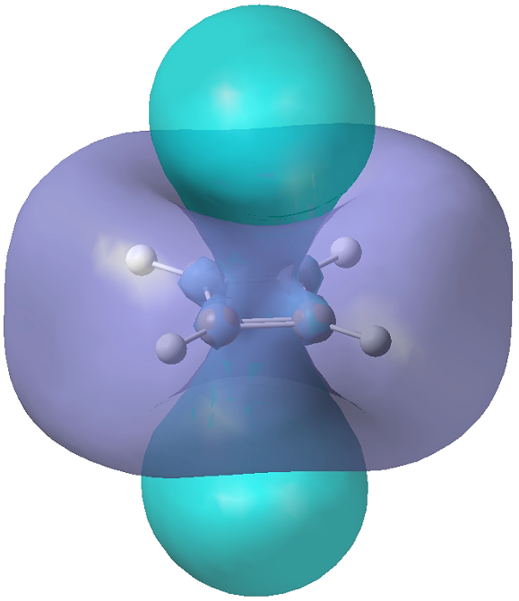

# 5.4 ICSS and NICS

## 5.4.1 ICSS of the ground state of cyclobutadiene
If you are not familiar with ICSS, you are recommended to read Sobereva's blog
[《通过Multiwfn绘制等化学屏蔽表面(ICSS)研究芳香性》](http://sobereva.com/216).
That blog contains necessary information of ICSS using HF/DFT methods.

Here we try to compute ICSS using the CASSCF method. The gjf file of the following
example can be found at `$MOKIT_ROOT/examples/automr/16-C4H4.gjf`. For convenience,
here is the content:

```
%mem=64GB
%nprocshared=16
#p CASSCF(4,4)/6-31G(d)

mokit{ICSS}

0 1
C     0.00000000    0.00000000    0.00000000
C     0.00000000    0.00000000    1.34900000
C     1.56200000    0.00000000    1.34894100
C     1.56200000   -0.00023900   -0.00005900
H    -0.76022400   -0.00000200   -0.76288200
H    -0.76022400    0.00013500    2.11188200
H     2.32222400    0.00000000    2.11182300
H     2.32222400   -0.00037400   -0.76294100

```

**Step 1. Submit the automr job**  
Run
```
automr 16-C4H4.gjf >16-C4H4.out 2>&1 &
```

This computation would take about 1 hour. For larger molecules, the computation is
very time-consuming and it might take one or two days. The basis set 6-31G(d) or
6-31+G(d) is recommended since larger basis set would cost too much computational
time. After the computation is accomplished, there would be a file named
`16-C4H4_uhf_gvb10_CASSCF_ICSS.cub`. This file can be visualized by GaussView,
Multiwfn or VMD.

**Step 2. Open the .cub file with GaussView**  
You can simply drag the .cub file into GaussView. Next, click the `Results` ->
`Surfaces/Contours`, set the `Density` to an appropriate value, e.g. 0.2. Finally,
click `Surface Actions` -> `New Surface`. Then a figure like the following picture
would be shown on your screen.



## 5.4.2 ICSS of S1 state of cyclobutadiene

Assuming you've accomplished the ICSS job of the ground state CASSCF. Now you can
study the ICSS at some excited state. Currently only excited states with the same
spin as the ground state are supported. For example, if the ground state is S<sub>0</sub>,
then S<sub>*n*</sub> (*n*>=1) electronic excited states are supported. If you are
interested in T<sub>1</sub> state, you should read Section 5.4.1, in which you can
set the spin multiplicity as triplet in the input file. T<sub>*n*</sub> (*n*>=2)
states are not supported currently. An input example for S<sub>1</sub> state is
shown below:

```
%mem=64GB
%nprocshared=16
#p CASSCF(4,4)/6-31G(d)

mokit{ist=5,readno='16-C4H4_uhf_gvb10_CASSCF_NO.fch',Root=1,ICSS}
```

where the file `16-C4H4_uhf_gvb10_CASSCF_NO.fch` was generated in the ground state
CASSCF job. `Root=1` stands for the first excited state. It is recommended to specify
the memory as large as possible.

## 5.4.3 NICS of cyclobutadiene
If you think ICSS computation is too time-consuming, then NICS is a good choice.
It usually takes only several seconds or minutes to obtain one or two points of
NICS values. Again, we use the cyclobutadiene as the example. The input file is

```
%mem=32GB
%nprocshared=16
#p CASSCF(4,4)/def2TZVP

mokit{NMR}

0 1
C      0.00000000    0.00000000    0.00000000
C      0.00000000    0.00000000    1.34900000
C      1.56200000    0.00000000    1.34894100
C      1.56200000   -0.00023900   -0.00005900
H     -0.76022400   -0.00000200   -0.76288200
H     -0.76022400    0.00013500    2.11188200
H      2.32222400    0.00000000    2.11182300
H      2.32222400   -0.00037400   -0.76294100

```

Since NICS computation is cheap, you can use a larger basis set like def2TZVP, rather
than 6-31G(d). Note that do not write `NICS` keyword in the input file, `NMR` is enough.

Firstly, you should submit this file to `automr`. Now assuming you've accomplished the
CASSCF computation, and next you want to compute NICS(1)<sub>ZZ</sub>. Just open the file
`16-C4H4_uhf_gvb10_CASSCF_NMR.mol` and add the Cartesian coordinates of dummy atom Bq:

```
ATOMBASIS
generated by utility bas_gms2dal in MOKIT
Basis set specified with gen
AtomTypes=9 Integrals=1.0D-14 Charge=0 NoSymmetry Angstrom
Charge=6. Atoms=1 Basis=INTGRL Blocks=3 1 1 1
... (abbreviated for brevity)
        0.8000000000        1.0000000000
```
<strong>
```
Charge=0. Atoms=1 Basis=INTGRL Ghost
Bq   0.7809234989   -1.0000597432    0.6745590841
```
</strong>

What you need to do is two things: (1) modify the AtomTypes from 8 to 9 (because
we add one Bq atom); (2) add coordinates of the Bq dummy atom in the end of the
file. The modification is shown in <strong>bold</strong> text above. The coordinates
of Bq can be obtained using Multiwfn, see [examples](http://sobereva.com/261). Then
submit this job to Dalton, e.g. running the following commands in Shell:

```
dalton -gb 16 -omp 16 -put "SIRIUS.RST" -noarch -ow 16-C4H4_uhf_gvb10_CASSCF_NMR &
```

This only takes 1-2 minutes. After it is finished, open the file `16-C4H4_uhf_gvb10_CASSCF_NMR.out`
and search `@1 Bq`, you can find the chemical shielding of this Bq atom is -11.9931
ppm. Remember that NICS(1)<sub>ZZ</sub> is the negative of the chemical shielding,
i.e. 11.9931 ppm.

