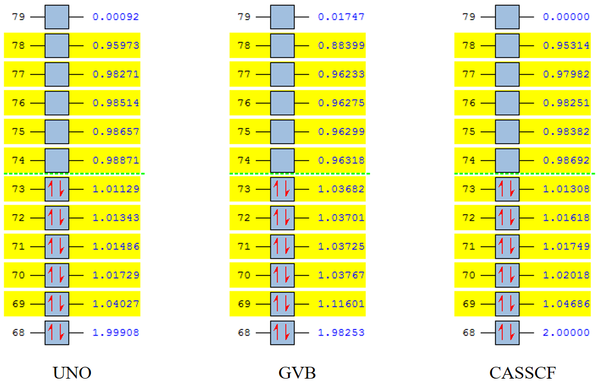

# 5.7 Examples of dinuclear transition metal molecules

## 5.7.1 [Fe<sub>2</sub>(OH)<sub>2</sub>(H2O)<sub>8</sub>]<sup>4+</sup>

I downloaded the geometry from some unknown website, so before performing multi-
reference computations, the geometry optimization is necessary. If you obtain the
geometry from crystal data, you may only need to optimize the positions of hydrogen
atoms. If you get the geometry from previous computational literature (with reasonable
computations therein), geometry optimization may be unnecessary.

Assuming we are studying the lowest antiferromagnetic singlet, the Gaussian input
file (.gjf) for geometry optimization is shown below

```
%chk=Fe2_ini.chk
%mem=200GB
%nprocshared=48
#p UBP86/TZVP nosymm guess(fragment=5) scf(xqc,maxcycle=500)

title

4 1 3 6 3 -6 -1 1 -1 1 0 1
Fe(Fragment=1)     0.56990000   -0.61710000   -0.77260000
Fe(Fragment=2)     2.46140000   -0.90030000   -3.11630000
O(Fragment=5)      0.83530000    1.50450000   -0.94550000
O(Fragment=3)      2.42280000   -0.91110000   -0.96240000
O(Fragment=5)      0.24940000   -2.71760000   -0.51100000
O(Fragment=5)     -1.54430000   -0.30870000   -0.63950000
O(Fragment=5)      0.63850000   -0.41510000    1.35780000
O(Fragment=4)      0.58860000   -0.83710000   -2.91460000
H(Fragment=5)      1.26180000    1.66120000   -1.77480000
H(Fragment=5)     -0.63350000   -2.89290000   -0.78630000
H(Fragment=5)     -1.70840000    0.57350000   -0.92580000
H(Fragment=5)      0.18020000    0.37680000    1.58020000
H(Fragment=5)      1.41960000    1.77430000   -0.26000000
H(Fragment=3)      2.55880000   -1.80250000   -0.69740000
H(Fragment=5)      0.30060000   -2.88260000    0.41550000
H(Fragment=5)     -1.77780000   -0.38080000    0.26940000
H(Fragment=5)      1.54020000   -0.32870000    1.61230000
H(Fragment=4)      0.27980000   -1.70780000   -3.08960000
O(Fragment=5)      2.57760000    1.24250000   -3.13070000
O(Fragment=5)      4.59560000   -0.97250000   -3.27840000
O(Fragment=5)      2.39960000   -3.04000000   -3.18650000
O(Fragment=5)      2.40100000   -0.88560000   -5.25630000
H(Fragment=5)      1.50560000   -0.76300000   -5.51910000
H(Fragment=5)      2.41410000    1.52980000   -4.01150000
H(Fragment=5)      4.91230000   -1.68440000   -2.75140000
H(Fragment=5)      3.25730000   -3.36430000   -2.97650000
H(Fragment=5)      3.46380000    1.46430000   -2.89930000
H(Fragment=5)      4.80310000   -1.14140000   -4.18100000
H(Fragment=5)      2.20300000   -3.27960000   -4.07670000
H(Fragment=5)      2.91120000   -0.15440000   -5.55730000

--Link1--
%chk=Fe2_ini.chk
%mem=200GB
%nprocshared=48
#p UBP86 chkbasis nosymm guess=read geom=allcheck scf(xqc,maxcycle=500) stable=opt

--Link1--
%chk=Fe2_ini.chk
%mem=200GB
%nprocshared=48
#p opt=calcfc freq UBP86 chkbasis nosymm guess=read geom=allcheck scf(xqc,maxcycle=500)

--Link1--
%chk=Fe2_ini.chk
%mem=200GB
%nprocshared=48
#p UBP86 chkbasis nosymm guess=read geom=allcheck stable=opt

```

This is a 4-step job. The 1st step sets up the fragment information of 5 fragments.
This is because we need the antiferromagnetic singlet (5 alpha electrons for Fe1
and 5 beta electrons for Fe2) solution. Such an SCF solution is often difficult to
be obtained using conventional HF/DFT initial guess, so here we use the fragment
guess.

The 2nd step reads MOs from previous step, converges the UBP86 orbitals and checks
the stability of UBP86 wavefunction. If not stable, the keyword stable=opt will automatically
optimize the wavefunction to a stable one. The 3rd step reads MOs from previous
step and starts geometry optimizations. Note that the wavefunction stability may
change during geometry optimizations, so we need the 4th step to ensure that we
get a stable wavefunction finally.

If the UBP86 energy in the 4th step becomes lower (than the electronic energy of
the final geometry in the 3rd step), it means that the frequency analysis in the
3rd step is useless since it is based on an instable wavefunction. In that case we
need to read MOs from the 4th step and continue geometry optimization. Fortunately,
in this example, we obtain the stable E(UBP86) = -3289.8489510 a.u. in the 3rd step
and it is not lowered in the 4th step.

Then we use the optimized geometry to perform multiconfigurational/multireference
computations. The `automr` input file (.gjf) is shown below

```
%mem=200GB
%nprocshared=48
#p CASSCF/TZVP guess(fragment=5)

mokit{GVB_conv=5d-4,hardwfn}

4 1 3 6 3 -6 -1 1 -1 1 0 1
Fe(Fragment=1)       0.525119   -0.497869   -0.708001
Fe(Fragment=2)       2.614048   -0.959498   -3.224439
O(Fragment=5)        0.629061    1.607749   -0.624032
O(Fragment=3)        2.509495   -0.820203   -1.255415
O(Fragment=5)        0.032247   -2.520107   -0.363336
O(Fragment=5)       -1.530291   -0.185439   -0.458412
O(Fragment=5)        0.900278   -0.419588    1.381845
O(Fragment=4)        0.629692   -0.637059   -2.676981
H(Fragment=5)        0.401400    2.259064   -1.321606
H(Fragment=5)       -0.381926   -3.161928   -0.979088
H(Fragment=5)       -1.996364    0.680813   -0.436459
H(Fragment=5)        0.194596   -0.275371    2.052603
H(Fragment=5)        0.786914    2.117185    0.201537
H(Fragment=3)        3.289968   -0.897141   -0.663082
H(Fragment=5)        0.055815   -2.947638    0.521352
H(Fragment=5)       -2.220899   -0.875872   -0.338272
H(Fragment=5)        1.736797   -0.507223    1.890496
H(Fragment=4)       -0.151051   -0.561947   -3.269202
O(Fragment=5)        3.107786    1.062670   -3.567445
O(Fragment=5)        4.669288   -1.273093   -3.474047
O(Fragment=5)        2.508898   -3.065004   -3.309713
O(Fragment=5)        2.239245   -1.036321   -5.314310
H(Fragment=5)        1.403078   -0.946473   -5.823151
H(Fragment=5)        3.085985    1.490862   -4.451860
H(Fragment=5)        5.134581   -2.139729   -3.497196
H(Fragment=5)        2.736911   -3.717012   -2.612900
H(Fragment=5)        3.521488    1.703609   -2.950468
H(Fragment=5)        5.360506   -0.583097   -3.593267
H(Fragment=5)        2.349591   -3.573694   -4.135462
H(Fragment=5)        2.944846   -1.181245   -5.984990

```

This input file will invoke the UHF(fragment guess)->UNO->localization->GVB->CASSCF
route. The keyword `GVB_conv=5d-4` means using a less tight GVB convergence threshold
(see the detailed explanations for `GVB_conv` in Section 4.4.42). And the keyword
`hardwfn` means extra keywords written into PySCF CASSCF input file to ensure spin
pure CASCI wave function since antiferromagnetic singlet with 5 alpha *v.s.* 5 beta
electrons is challenging.

Once the `*_uno.fch` file is generated, you should open it and see whether there
are (at least) 10 UNOs whose occupation numbers are close to 1.0. This is to make
sure that we obtain the desired antiferromagnetic singlet UHF solution. Here are
my calculated UNO, GVB and CASSCF NOONs:



The GVB NOs and CASSCF NOs are stored in `*_s.fch` and `*_CASSCF_NO.fch` files,
respectively. The figures shown above can be visualized by opening the corresponding
.fch file using GaussView. Note that here they are not orbital energies, but natural
orbital occupation numbers (NOONs). The automatically determined active space is
CAS(10,10), and you can see there are 10 NOs with occupation numbers near 1.0, no
matter for UNO, GVB or CASSCF NOs.

The current CAS(10,10) active space is supposed to be adequate for qualitatively
correct descriptions of the ground state and *d*->*d* transitions. If you perform
the SA-CASSCF(10,10) computation based on current CASSCF NOs, you can obtain reasonable
excited energies. For quantitatively accurate excited energies, you should perform
the state-specific NEVPT2 computations based on each CASCI root. For even better
excited energies, QD-NEVPT2 computations can be performed. Here is the `automr` input
file for SA-CASSCF and state-specific NEVPT2 computations:

```
%mem=200GB
%nprocshared=48
#p NEVPT2(10,10)/TZVP

mokit{ist=5,readno='Fe2_uhf_gvb32_CASSCF_NO.fch',nstates=12,hardwfn}
```

If you want larger active space (e.g. which can describe metal-ligand excitations),
you should look into GVB NOs (i.e. `*_s.fch` file) and find which orbitals you want
to add in.

