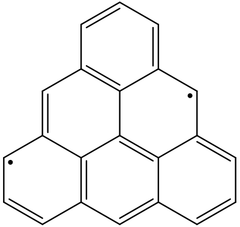

# 5.9 Visualization of upaired electrons
After a multiconfigurational/multireference calculation is accomplished, people often want to know where the unpaired electron is, or at which atom(s) are unpaired electrons located. 3 approaches are introduced below.

## 5.9.1 Visualization of natural orbitals
Taking the triangulene molecule as an example  


The geometry has been optimized at the UCAM-B3LYP/6-31G(d,p) level. This molecule has a triplet ground state (T0). But firstly, let's perform the CASSCF calculation of the lowest singlet (S1), which is expected to be of significant biradical/diradical character. The input file of `automr` (say, triangulene_cc-pVDZ_S.gjf) is

```
%mem=96GB
%nprocshared=48
#p CASSCF/cc-pVDZ

mokit{FcGVB,Npair=11,GVB_conv=5d-4,LocalM=Boys}

0 1
C       -6.99392200   -0.69965300    0.03089200
C       -6.99037600   -2.08681100    0.00754000
C       -5.79692300   -2.79373800   -0.01900700
C       -4.55293000   -2.11706000   -0.02294700
C       -4.54759300   -0.69024300    0.00094600
C       -5.77962500    0.02901000    0.02825000
C       -3.32798900   -2.80487500   -0.04954900
C       -2.09696100   -2.12716900   -0.05329300
C       -2.08976500   -0.70050100   -0.02943100
C       -3.31558100    0.01410700   -0.00232100
C       -0.85924300   -2.81425700   -0.08011500
C        0.34050600   -2.11749600   -0.08271500
C        0.35636800   -0.73047500   -0.05962300
C       -0.85143000    0.00846700   -0.03273200
C       -3.30942000    1.43300300    0.02142600
C       -4.54239100    2.15073200    0.04875200
C       -5.75083800    1.43372600    0.05151200
C       -0.86802700    1.41341100   -0.00896700
C       -2.07013000    2.14041600    0.01811300
C       -2.09382400    3.55612800    0.04213800
C       -3.29698300    4.24638100    0.06855300
C       -4.50617000    3.56622700    0.07202700
H       -7.93196300   -0.15396700    0.05161000
H       -7.93251100   -2.62540600    0.01006600
H       -5.80270700   -3.87898600   -0.03717500
H       -3.33266200   -3.89097400   -0.06780500
H       -0.86309200   -3.89951400   -0.09839300
H        1.27782500   -2.66405100   -0.10333100
H        1.29927000   -0.19284000   -0.06197400
H       -1.15202100    4.09568800    0.03963300
H       -3.29222900    5.33144200    0.08668400
H       -5.44315500    4.11372400    0.09272200
H        0.07497000    1.95259200   -0.01139400
H       -6.68913500    1.98066500    0.07227600

```

Keywords in `mokit{}` are specified to make the GVB SCF not converged to \\( \sigma \\) - \\( \pi \\) mixing solution, so that 11 pure C=C \\( \pi \\) bonding orbitals and 11 pure \\( \pi \\)* anti-bonding orbitals will be used in CASSCF calculations. Submit this job
```
automr triangulene_cc-pVDZ_S.gjf >triangulene_cc-pVDZ_S.out 2>&1
```

This job will take about 5 hours using 48 CPU cores. Since the active space would be (22,22), the CASSCF would automatically be switched to DMRG-CASSCF during calculation. After the job is accomplished, we obtain 3 fch files which includes natural orbtials
```
triangulene_cc-pVDZ_S_uhf_uno.fch
triangulene_cc-pVDZ_S_uhf_uno_asrot2gvb11_s.fch
triangulene_cc-pVDZ_S_uhf_gvb11_CASSCF_NO.fch
```

which include UHF natural orbitals (UNOs), GVB NOs, and CASSCF NOs, respectively. 
Choose a file, open it using GaussView, click `MO Editor`, and click `Visualize` (if it is in grey color and cannot be clicked, it implies that you need to install the Gaussian software). By default, the 72th and 73th NOs are supposed to be highlighted. If they are not, you can click/choose them to be highlighted. Change `Isovalue` if you want (0.04 will be used in the following figures). Finally, click `Update` and wait for a few seconds. 
Here are the HONO and LUNO of GVB and DMRG-CASSCF calculations, respectively


(NOONs are shown below corresponding orbitals)

The natural orbital occupation numbers (NOONs) of HONO and LUNO are close to 1.0, which means 1 unpaired electron is occupied in each of these orbitals. It can be seen that these NOs are somewhat delocalized, but mainly with C_1 and C_18 the largest populations. So the following skeletal formula may represent the molecule better



Moreover, the number of unpaired electrons can be found in output
```
E(GVB) =      -840.26647527 a.u.
----------------------- Radical index -----------------------
biradical character   (2c^2) y0=  0.945
tetraradical character(2c^2) y1=  0.038
Yamaguchi's unpaired electrons  (sum_n n(2-n)      ):  3.086
Head-Gordon's unpaired electrons(sum_n min(n,(2-n))):  2.445
Head-Gordon's unpaired electrons(sum_n (n(2-n))^2  ):  2.051
-------------------------------------------------------------
...
E(CASSCF) =      -840.43136870 a.u.
----------------------- Radical index -----------------------
biradical character   (2c^2) y0=  1.004
tetraradical character(2c^2) y1=  0.129
Yamaguchi's unpaired electrons  (sum_n n(2-n)      ):  5.015
Head-Gordon's unpaired electrons(sum_n min(n,(2-n))):  3.572
Head-Gordon's unpaired electrons(sum_n (n(2-n))^2  ):  2.531
-------------------------------------------------------------
```

The number of unpaired electrons are calculated based on all NOs, so they will be slightly larger than 2 (the definition sum_n (n(2-n))^2 is recommended). Anyway, we know that there exists 2 unpaired electrons for the S1 state of this molecule.

If you think DMRG-CASSCF calculation is too expensive, you can perform only the GVB calculation, and use GVB NOs in the `*_s.fch` file to demonstrate unpaired electrons or diradical characters.

Note that these techniques/tricks can, of course, also be applied to the analysis of single reference calculations. For example, assuming we want to find the open-shell singlet excited state of the ethene molecule using RKS-based TDDFT. Here is the ethene.gjf file
```
%chk=ethene.chk
%mem=16GB
%nprocshared=8
#p PBE1PBE/cc-pVDZ TD(nstates=10) nosymm int=nobasistransform density

title

0 1
 C                 -1.76890146   -0.14978602    0.00000000
 H                 -1.23573772   -1.07749094    0.00000000
 H                 -2.83890146   -0.14978602    0.00000000
 C                 -1.09362716    1.02519128    0.00000000
 H                 -1.62679090    1.95289620    0.00000000
 H                 -0.02362716    1.02519128    0.00000000


--Link1--
%chk=ethene.chk
%mem=16GB
%nprocshared=8
#p PBE1PBE chkbasis nosymm int=nobasistransform guess(read,only,save,NaturalOrbitals) geom=allcheck

```

Once the the Gaussian job is accomplished, you can find the S1 state is mainly contributed by 8->9 excitation
```
 Excited State   1:      Singlet-?Sym    7.9680 eV  155.60 nm  f=0.3635  <S**2>=0.000
       8 ->  9         0.70368
       8 <-  9        -0.10343
```
Since TDDFT only takes one-electron excitations into consideration and RKS-based TDDFT in Gaussian is a spin-adapted method, 8->9 excitation stands for the linear combination of two Slater determinants sqrt(2)/2 (8a9b - 8b9a), which is open-shell singlet.

We can double check via TDDFT NOs. Run
```
formchk ethene.chk ethene.fch
```
Natural orbitals of the S1 state are kept in `ethene.fch`. NOs with occupation numbers significantly deviate from 2.0/0.0 are


which means that the C-C pi/pi* orbital has one unpaired electron, respectively. Whether using unrelaxed or relaxed density usually does not matter here. See Section 5.9.3 below for unpaired electrons and unpaired electron density.


## 5.9.2 Visualization of localized active orbitals
You might notice that for the example shown above, the CASSCF occupation number of HONO happens to be almost equal to that of LUNO. It can be viewed as degeneracy in occupation numbers. So we can perform orbital localization upon these 2 NOs without changing their occupation numbers. 
Start Python and run

```python
from mokit.lib.gaussian import loc
loc(fchname='triangulene_cc-pVDZ_S_uhf_gvb11_CASSCF_NO.fch',idx=range(71,73))
```

Then a file named `triangulene_cc-pVDZ_S_uhf_gvb11_CASSCF_NO_LMO.fch` is obtained. These two active orbitals will become a little more localized.

This trick can also be applied to high-spin triplet GVB or CASSCF calculations, in which there will be (at least) two unpaired alpha electrons in GVB or CASSCF NOs. Whenever singly occupied orbitals are delocalized, orbital localization will do much help.

Note that if you apply this trick to NOs which are not degenerate in occupation numbers, their occupation numbers will no longer exist, and only occupation number expectation values exist (i.e. the occupation number matrix becomes not diagonal).


## 5.9.3 Visualization of unpaired electron density
In unrestricted DFT (UDFT) calculations, people often visualize the spin density to find where the unpaired electrons are. In multiconfigurational methods, the unpaired electron density (also called odd electron density) is often used to show the spatial distribution of unpaired electrons. Using the CASSCF NOs of the S1 state as an example, start Python and run

```python
from mokit.lib.wfn_analysis import calc_unpaired_from_fch
calc_unpaired_from_fch(fchname='triangulene_cc-pVDZ_S_uhf_gvb11_CASSCF_NO.fch',wfn_type=3,gen_dm=True)
```

This will generate the unpaired electron density stored in `triangulene_cc-pVDZ_S_uhf_gvb11_CASSCF_NO_unpaired.fch`. There are various ways to visualize the unpaired electron density:

**(1) Visualizing via GaussView**  
Run the following command in Shell
```
cubegen 48 fdensity triangulene_cc-pVDZ_S_uhf_gvb11_CASSCF_NO_unpaired.fch triangulene_unpaired.cub -3 h
```
which uses 48 CPU cores to generate the cube file. Note here the `fdensity` cannot be replaced by `density=SCF`.

Open the file `triangulene_unpaired.cub` with GaussView, click `Results` on the panel, click `Surfaces/Contours`, change the value of `Density =` to 0.01 a.u., click `Surface Actions` and finally click `New surface`. The plot would be like


**(2) Visualizing via Multiwfn**  
Start Multiwfn and load the file `triangulene_cc-pVDZ_S_uhf_gvb11_CASSCF_NO_unpaired.fch`, then type
```
200
16
SCF
y
0
5
1
3
-1
```
The key idea is to make Multiwfn read the `Total SCF Density` section in .fch file and generate corresponding cubes. Note that the procedure above (i.e. integers input interactively) may be slightly different for different versions of Multiwfn, you should pay attention to the information/hints shown in the Multiwfn cmd window. Finally, change the `Isosurface value` to 0.01 a.u. and the plot would be like


Of course, you can use also Multiwfn + VMD to get even better plots.

Note that the unpaired electrons as well as density can, of course, also be applied to the analysis of single reference calculations (MP2, CCSD, TDDFT, etc). Taking the S1 natural orbtial file `ethene.fch` as an example, running the following Python script

```python
from mokit.lib.wfn_analysis import calc_unpaired_from_fch
calc_unpaired_from_fch(fchname='ethene.fch',wfn_type=3,gen_dm=True)
```

The number of unpaired electrons are printed on the screen
```
----------------------- Radical index -----------------------
biradical character y0 = n_LUNO =  0.988
tetraradical character y1 = n_{LUNO+1} =  0.021
Yamaguchi's unpaired electrons  (sum_n n(2-n)      ):  2.169
Head-Gordon's unpaired electrons(sum_n min(n,(2-n))):  2.060
Head-Gordon's unpaired electrons(sum_n (n(2-n))^2  ):  2.004
-------------------------------------------------------------
```
where an open-shell singlet species is supposed to have about 2.0 unpaired electrons. Besides, the file `ethene_unpaired.fch` is generated and the unpaired electron density is located on two C atoms


